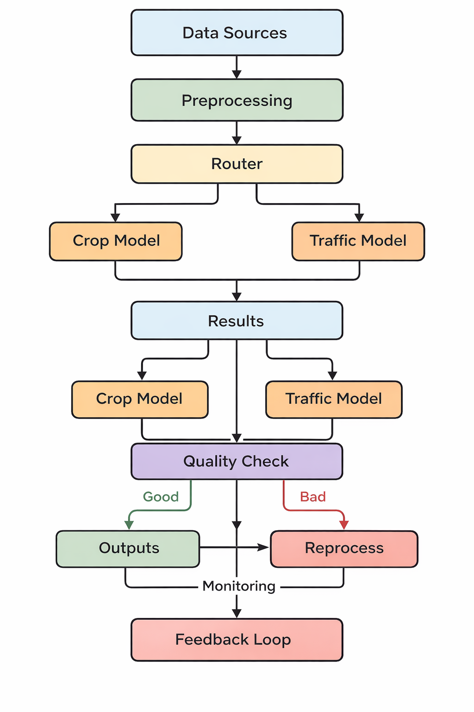

# Task 4a: System Architecture Diagram
## End-to-End Pipeline: Raw Imagery to GeoJSON/Reports

## Architecture Flowchart

---

## Layer Descriptions

### Data Ingestion Layer
Satellite (Sentinel-2, Planet) and UAV feeds land in cloud object storage. A CRS normalizer reprojects all inputs to WGS84 (EPSG:4326) using rasterio before tiling. The tile generator slices large scenes into 512×512 patches with 64px overlap to prevent boundary artefacts.

### Inference Layer
The domain router classifies each tile as crop or traffic using keyword heuristics + LLM fallback. Tiles are queued to a GPU pool (A100 for production, T4 for dev) for batched inference. SegFormer-B2 handles crop segmentation; YOLOv8m + ByteTrack handles vehicle detection and tracking. A tile stitcher merges overlapping predictions via softmax averaging before argmax decoding.

### Agentic Orchestration Layer
A LangGraph state graph connects three agents. The Orchestrator routes and schedules; the QC Agent validates confidence and triggers re-inference or escalation; the Reporting Agent generates NL summaries using Gemini. Short-term memory holds per-batch state; long-term memory persists cross-batch metrics for drift detection.

### Output Layer
Final outputs are GeoJSON (crop fields with health index), traffic heatmaps (PNG/GeoTIFF), and NL batch reports. A Folium/Kepler.gl dashboard visualises spatial outputs. Critical anomalies trigger alerts via email or Slack webhook.

### Feedback Loop
All batch metrics are logged to MLflow. A drift detector computes rolling confidence scores, if drift exceeds threshold, hard samples are flagged for curation and a retraining job is triggered. New model weights are versioned in the model registry and deployed back to the inference layer.